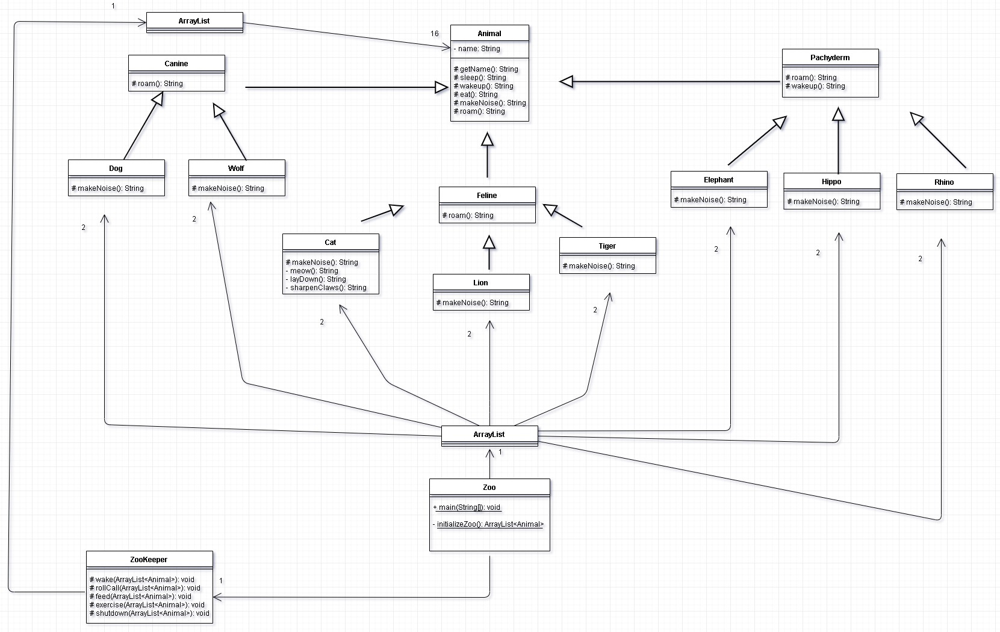

# Zoo
### Project1 for CSCI5448

Team Member: 
* Yutaka Urakami
* Mengyu Wu
* Hao Wu 

### UML diagram for this project:

### Instruction for running the code:
Our code is base on Java8 version. To run the code, go to **Zoo/src/zoo/Hao_Linus_Yuta/Zoo.java**, which contains the main function. Run this file, and you will get a bunch of output in the console ([outfile.txt](/outfile.txt)).

